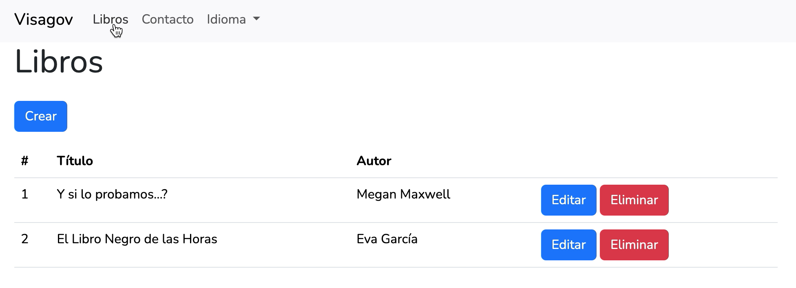

# Awesome Library Manager

Welcome to My Awesome Library Manager! This web application is built with Laravel and designed to help you manage your library of books effortlessly.

<p align="center"><a href="https://laravel.com" target="_blank"></a></p>

<p align="center"></p>

## Features

-   **Book Management:** Easily add, edit, and delete book entries.
-   **Multiple Languages:** Support for multiple languages, so your library can reach a global audience.
-   **Contact Form:** A built-in contact form with server-side validation to keep in touch with your users.

## Getting Started

### Prerequisites

-   Ensure you have [Composer](https://getcomposer.org/) and [PHP](https://www.php.net/) installed.
-   You'll need a web server like [XAMPP](https://www.apachefriends.org/) or [Homestead](https://laravel.com/docs/8.x/homestead) for local development.

### Installation

1.  Clone the repository:

    ```bash
    git clone https://github.com/yourusername/awesome-library-manager.git
    ```

2.  Install dependencies:

    ```bash
    cd awesome-library-manager
    composer install
    ```

3.  Set up your environment variables:

    ```bash
    cp .env.example .env
    php artisan key:generate
    ```

4.  Configure your database connection in the .env file:

    ```bash
    DB_CONNECTION=mysql
    DB_HOST=127.0.0.1
    DB_PORT=3306
    DB_DATABASE=laravel_project
    DB_USERNAME=root
    DB_PASSWORD=test123
    ```

5.  Migrate the database:

    ```bash
    php artisan migrate
    ```

6.  Serve the application:

    ```bash
    php artisan serve
    ```

7.  Visit http://localhost:8000 in your web browser.

### Usage
- Explore the user-friendly interface to add, edit, or remove books.
- Use the language dropdown to switch between supported languages.

## Contributing
Contributions are welcome! Feel free to open an issue or create a pull request.

## License
This project is licensed under the MIT License - see the LICENSE file for details.

## Acknowledgments
- Laravel - The PHP framework used for building this application.
- Bootstrap - The front-end framework that makes the UI look great.
- Laravel Localization - For handling multiple languages.

Thank you for checking out My Awesome Library Manager! If you have any questions or suggestions, feel free to reach out.

# Happy reading!
